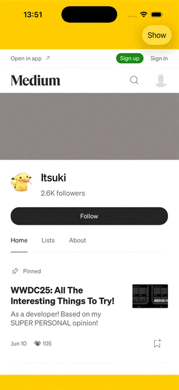

# SwiftUI Webview / WebPage Demo

A demo on using the Webview and Webpage introduced in WWDC 2025.

For more details,
- [SwiftUI: Huge Dive into The “Native” Webview & WebPage](https://medium.com/@itsuki.enjoy/swiftui-huge-dive-into-the-native-webview-webpage-f0c365d057cc)

## Webview Demo
- Show Web contents of a URL
- Control Scrolling behavior (show scroll to top button on scrolling down)
- Customize Interactions Behavior
- Customize webView Content Background

## Webpage Demo
- Set cookies, Set User Agent, default navigation behaviors, and etc
- Inject javascript
- Manage navigations
- Customize Javascript Actions (show alerts in App)
- Capture and share contents as Image and PDF
- custom loaders, controls (back, forward buttons), titles for a better user experience

